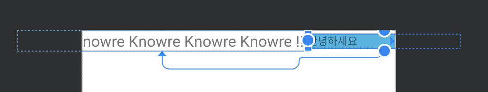
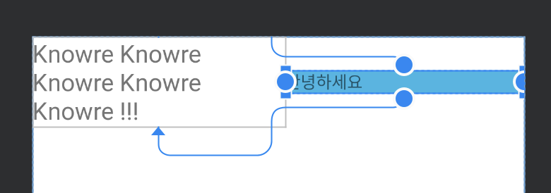
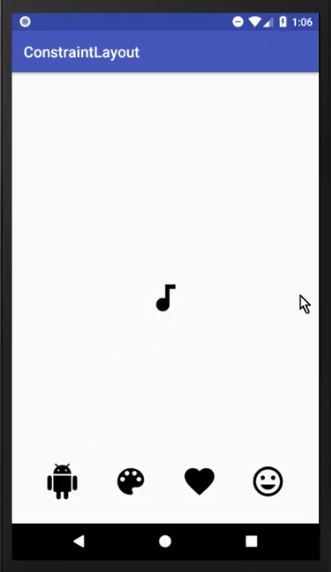

# ConstraintLayout

`ConstraintLayout`은 `ViewGroup`의 일종으로, 배치하려는 `View` 간에 다양한 constraint(제약)를 설정하여 복잡한 레이아웃을 flat 하게 구성할 수 있다. 또한  `MotionLayout` 으로 애니메이션을 구현하기 위해서는 필수로 알아야한다.

<br>

## 📌 Overview

1. ConstraintLayout 으로 뷰 배치하기
   - 다양한 제약조건
   - Chain 으로 뷰끼리 연결하기
2. Helper Objects
   - Guideline
   - Barrier
   - Group
   - Placeholder
3. ConstraintLayout 사용시 주의사항

<br>

### dependencies

최신 버전은 [릴리즈노트](https://developer.android.com/jetpack/androidx/releases/constraintlayout)에서 확인할 수 있다. 2020년 3월 24일 기준으로 stable 은 1.1.3, beta 는 2.0.0-beta4 가 최신이다.

```groovy
dependencies {
  implementation "androidx.constraintlayout:constraintlayout:${version}"
}
```

<br>

## 📌 ConstraintLayout 으로 뷰 배치하기

### 👉🏻 다양한 제약조건

#### 뷰 배치하기

ConstraintLayout 은 뷰의 위치를 다른 뷰에 제약조건을 설정하여 지정할 수 있다. RelativeLayout 과 유사하게 상대적으로 위치를 잡는다는 특징이 있고, 아래와 같은 제약조건을 설정할 수 있다.

- top, bottom, left(start), right(end)

```xml
app:layout_constraint[Base]_to[Target]Of

ex)
app:layout_constraintStart_toEndOf="@+id/top_view" // target 뷰의 start 를 top_view 의 end 에 맞춤
app:layout_constraintTop_toBottomOf="parent" // target 뷰의 top을 parent의 bottom에 맞춤
```


> left, right 속성으로 지정하면 안드로이드 스튜디오에서 RTL 환경에서 제대로 동작하지 않는다는 warning 을 준다. 만약 RTL 을 고려하지않고 일관적인 위치에 두고싶다면 left, right 속성을 사용하는 것이 옳다(상황에 따라 적절하게 판단하기!). 이에 대한 추가적인 내용은 [여기](https://developer.android.com/training/basics/supporting-devices/languages#SupportLayoutMirroring)에서 알아보자. RTL은 개발자옵션에서 설정할 수 있다.

- 뷰에 Margin 적용하기

  - 해당 방향에 대한 constraint 가 정의되어있어야한다.

    - `android:layout_marginXXX`

  - 연결되었던 뷰가 GONE 상태일 때 margin 도 적용할 수 있다. 

    - GONE 상태더라도 constraint 는 유지된다(뷰 크기가 0으로만 세팅될 뿐 위치는 변함없다).
    - `android:layout_goneMarginXXX`

    

- 중앙에 배치하기
  - horizontal 은 left(start), right(end)
  - vertical 은 top, bottom 이용

```xml
app:layout_constraintStart_toStartOf="parent"
app:layout_constraintEnd_toEmdOf="parent"
```

- bias 를 이용한 위치 조정(0.0~1.0)
  - 0에 가까울수록 왼쪽, 1에 가까울수록 오른쪽으로 붙는다.
  - 0.5는 중심이다.

```xml
app:layout_constraintHorizontal_bias="0.5"
```

- 원형으로 배치하기

```xml
app:layout_constraintCircle="@+id/target_view"
app:layout_constraintCircleRadius="48dp"
app:layout_constraintCircleAngle="45"
```


#### 뷰 크기정하기

ConstraintLayout 에서 뷰의 크기를 정하는 방법은 아래와 같다.

- 명시적 크기
- `WRAP_CONTENT`
  - 이 속성을 사용하면 크기가 설정한 제약조건을 벗어날 수 있는데, 아래와같이 제약조건을 벗어나지 않도록 설정해야한다. (디폴트는 false)

```xml
app:layout_constrainedWidth=”true|false”
app:layout_constrainedHeight=”true|false”
```

- MATCH_CONSTRAINT`(== 0dp) : 설정한 제약조건 내 최대 크기

  - 상한, 하한 설정 : `layout_constraintWidth_min`,`layout_constraintWidth_max`, `layout_constraintHeight_min`, `layout_constraintHeight_max`
  - 퍼센트로 설정 : `app:layout_constraintHeight_percent`, `app:layout_constraintWidth_percent`
    - constraint 가 설정된 뷰의 크기에 비례하여 설정함(padding 제외)
  - 비율로 설정 : `app:layout_constraintDimensionRatio="(W|H,)[width]:[height]"`
    - ex. `app:layout_constraintDimensionRatio="H,16:9" ` (height:width)
  - 위 속성을 잘 조합하면 아래와 같은 UI 를 쉽게 구성할 수 있다.

  ```xml
  <!-- 높이의 20% 만큼 크기를 가지는 정사각형을 그림  -->
  android:layout_height="0dp"
  app:layout_constraintHeight_percent="0.2"
  app:layout_constraintDimensionRatio="1:1"
  ```

>  Note: [공식문서](https://developer.android.com/reference/androidx/constraintlayout/widget/ConstraintLayout#developer-guide)에 의하면 ConstraintLayout 에서는 `MATCH_PARENT` 를 사용하는 것을 권장하지 않는다고한다. *이유는 모른다...*

##### Example

width 가 `WRAP_CONTENT` 인 텍스트뷰와 width 가 200dp 인 텍스트뷰

 `app:layout_constrainedWidth=false`로 설정한 경우



`app:layout_constrainedWidth=true`로 설정한 경우



리사이클러뷰에 대한 적용 예제는 [여기]([https://kimch3617.tistory.com/entry/Android-RecyclerView-%EA%B0%80%EB%B3%80%EB%86%92%EC%9D%B4-%EC%A7%80%EC%A0%95%ED%95%98%EA%B8%B0](https://kimch3617.tistory.com/entry/Android-RecyclerView-가변높이-지정하기))에서 읽어볼 수 있다.

<br>

### 👉🏻 Chain 으로 뷰끼리 연결하기

여러개의 뷰가 서로간에 constraint 속성이 연결되어있다면 chain 이 생성된다. 생성된 chain 을 이용하면 관련된 뷰들을 어떤식으로 연결할지 정할 수 있다.

> chain 설정은 타자로 직접 치는 것은 조금 귀찮은데, Android studio design 탭에서 클릭만으로 쉽게 할 수 있다.


chain 은 수평, 수직 기준으로 가장 좌상단에있는 뷰가 기준(Head)이 된다. chain 스타일은 여러 형태가 존재하는데, 기준 뷰에 `layout_constraintHorizontal_chianStyle` 또는 `layout_constraintVertical_chianStyle` 속성을 적용하면 된다. 스타일의 종류는 아래와 같다.

```xml
app:layout_constraintHorizontal_chainStyle="packed|spread(기본값)|spread_inside"
app:layout_constraintVertical_chainStyle="packed|spread|spread_inside"
```


- spread
  - default 값으로, 뷰들을 펼쳐 여백을 같게한다.
  - weighted
    - 뷰의 길이가 0dp 일 경우 남은 공간을 weight 만큼 나눠갖는다. (LinearLayout 에서 weight 처럼 동작)
    - `layout_constraintHorizontal_weight`, `layout_constraintVertical_weight` 로 weight 를 설정하면 된다.
- spread_inside : 가장 외곽에 있는 뷰들을 부모뷰와 여백이 없게 붙인다.
- packed
  - 연결된 뷰들이 밀착하게되고 부모뷰로부터 여백을 같게한다.
  - 여백을 조정하고싶다면 기준 뷰에 `app:layout_constraintHorizontal_bias`, `app:layout_constraintVertical_bias` 로 bias 를 조정하면 된다. (0.0~1.0)

<br>

## 📌 Helper Objects

ConstraintLayout 으로 레이아웃을 구성할 때 도움을 주는 특별한 객체들이 있다. 이 객체들은 실제로 보이지않으며(View.GONE) preview 에서만 확인 가능하다.

### 👉🏻 barrier, guideline, group

이들에대한 설명은 [[Blog] Android Jetpack - ConstraintLayout / Helper Object](https://velog.io/@tura/android-jetpack-constraint-layout#helper-objects)에 깔끔하게 정리되어있으니 참고하면 된다.

### 👉🏻 Placeholder

Placeholder 는 배치된 뷰의 위치를 조정할 수 있는 가상 객체이며, 아래와 같이 동일한 위치와 속성을 가진 뷰를 갈아끼우기에 용이하다. (아래에 있는 뷰를 터치할 경우 가운데 이미지뷰로 교체된다.) 그리고 [Youtube - ConstraintLayout Tutorial Part 5 - PLACEHOLDERS & ANIMATIONS - Android Studio Tutorial](https://www.youtube.com/watch?v=LQ1DKrCYwz4) 의 후반부에서 이를 활용하여 가로, 세로 화면의 레이아웃 교체를 쉽게 하는 가이드를 볼 수 있다.



또한 몇가지 참고사항은 아래와 같다. [출처](https://blog.naver.com/pistolcaffe/221290283458)

- placeholder 는 동적으로 새로운 뷰를 추가하기 위한 helper class 가 아니다. 이미 같은 계층 상으로 layout 되어있는 뷰를 재배치할 때 사용된다.
- placeholder 에 재배치하려는 뷰는 같은 계층에 속해 있어야한다.
- 만약 재배치 하려는 뷰가 chain 상태에서 재배치가 이뤄질 경우, chain 관계에 있던 나머지 뷰들간의 chain 관계는 유지 된다. 이는 재배치 하려는 뷰를 gone 처리 하였을 때 chain 이 유지 되는 것과 같다.

> Note: 테스트해본결과, placeholder 의 width, height 가 0dp(match_constraint) 가 아닐 경우 비정상으로 동작(gone 도 아닌데 placeholder 가 사라짐)하는걸 발견했다.


<br>

## 📌 ConstraintLayout 사용시 주의사항

성능상의 이유로 공식 홈페이지에서도 중첩을 피하라고 권한다.

> Beta 버전으로 개발하다가 API 19 디바이스에서 뷰가 제대로 그려지지 않았던 경험을 했다. 버전을 낮추니 해결됐지만, 공식가이드를 따르자.

ConstraintLayout 으로 복잡하게 구성한 레이아웃을 개선하며 성능 비교를 해보려했지만 추후에 direct 푸시로 추가할 예정이다.


<br>

## 📌 References

- [[Android Developer Guide] Build a Responsive UI with ConstraintLayout](https://developer.android.com/training/constraint-layout#constraints-overview)
- [[Blog] Android Jetpack - ConstraintLayout](https://velog.io/@tura/android-jetpack-constraint-layout)
- [[Blog] Constraint Layout – Part1. 만능 레이아웃](https://www.charlezz.com/?p=669)