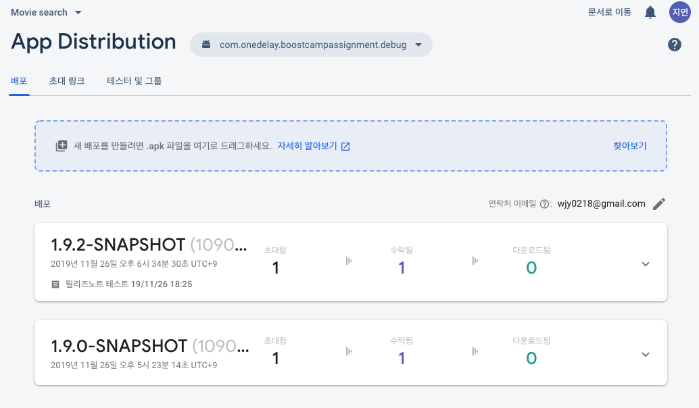
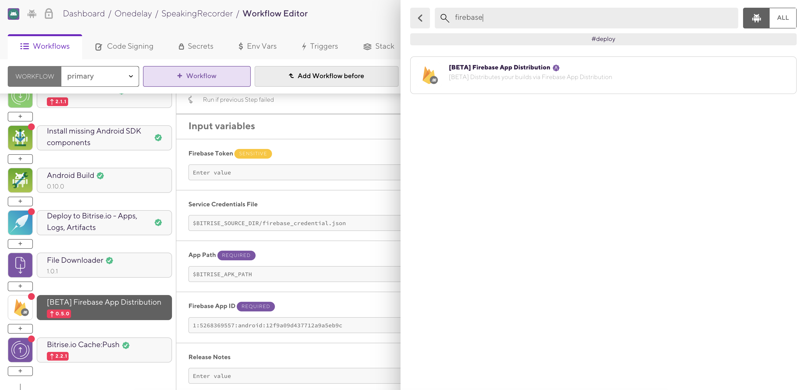
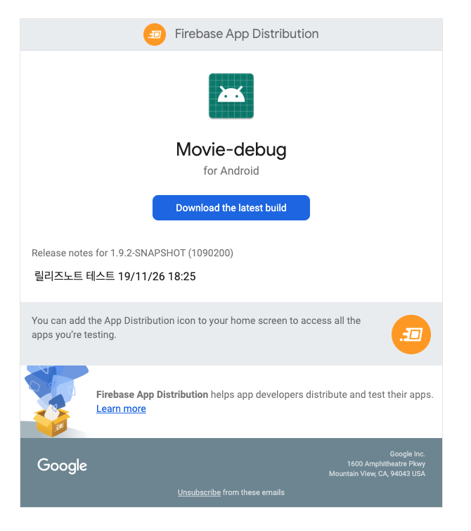
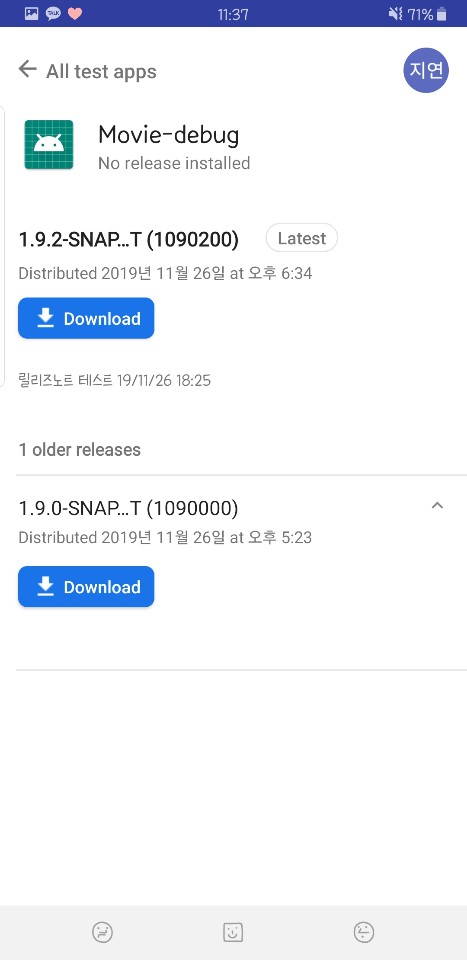

# App Distribution

이번 장에서는 테스트 앱을 배포할 수 있는 툴에 대해 알아보려고한다. 앞서 설명한 [Bitrise](https://github.com/Knowre-Dev/AndroidDevCurriculum/blob/master/KnowreSpecific/CICD/Bitrise/Bitrise.md)의 워크플로우에 이 툴을 이용해 배포하는 작업을 추가하면, 코드 푸시 한번만으로 테스터들에게 배포할 수 있는  환경을 구축할 수 있다. (배포 자동화 완성!)

기존에 Knowre에서 사용했던 툴은 Fabric crashlytics 에서 제공하는 [Beta](https://docs.fabric.io/apple/beta/overview.html)였으나, Fabric 은 2020년 3월 말 shutdown 되기때문에 Firebase 로 마이그레이션 할 예정이다. 따라서 Firebase 에서 제공하는 App distribution 에 대해 알아보자.

> Fabric RIP...😢

 

## 📌 개요

먼저 [Firebase App Distribution Docs](https://firebase.google.com/docs/app-distribution?authuser=0)에서 설명하는 주요 기능을 요약하면 아래와 같다.

- 특별한 설치 작업 없이 테스터에게 QA 버전의 앱을 빠르게 배포할 수 있다.
- **Firebase Console, Firebase CLI 도구 또는 Gradle(Android)을 사용하여 빌드 결과물을 배포할 수 있다.**
  -  **CI 워크플로우에 추가하여 배포를 자동화할 수 있다.**
- 테스터를 그룹 단위로 구성하여 쉽게 관리할 수 있다.

위에 스크린샷 처럼 Firebase 콘솔에서 테스터 및 그룹을 쉽게 관리할 수 있으며, 현재 배포된 버전을 한눈에 파악할 수 있다. 

 

## 📌 App distribution 설정

사전단계로 먼저 Firebase 프로젝트 설정(안드로이드 프로젝트와 연동)이 필요하다. 이 방법은 [Firebase docs]()를 참고하자.

[Firebase App Distribution Docs](https://firebase.google.com/docs/app-distribution?authuser=0)에서 설명하는 배포 설정 과정은 아래와같이 총 3가지가 있지만, 우리는 Bitrise 에서 제공하는 Task 를 추가하여 설정할 것이다.

1. Firebase console : 제일 쉽지만 나중엔 귀찮은 방법
2. Firebase CLI
3. Gradle

> Gradle 방식으로 배포하는 방법에 대한 삽질기를 [여기](https://www.notion.so/Firebase-App-distribution-Beta-838f8a91b14e4c32bbaaaf68b1236357)에서 읽어볼 수 있다.

 

### 🐾 Bitrise 에서 App Distribution 설정하기

Bitrise 에는 아래와 같이 Firebase App Distribution 을 간편하게 설정해주는 Task 를 추가할 수 있다.

이제 이 Task 를 수행하기위해 필요한 input 값을 설정해야한다. 위의 3가지 방법중 어떤 방법을 사용하는지는 해당 Task 오픈소스를 확인해보면 알 수 있을 것이다.

이 Task를 수행하기위해 필요한 값들에 대해 정리하면 다음과 같다.

- **Service credentials file : Firebase distribution 계정 인증에 필요**
  - 이 파일은 외부에 노출해서는 안된다. 만약 public 저장소에 업로드할 경우 구글로부터 경고 이메일이 온다. (사실 키를 disable 해버리면 끝이지만, 하지 말란것은 하지 말자.)
- **App path : 배포할 apk 파일의 경로**
  - 스크린샷과 같이, `$BITRISE_APK_PATH` 변수를 설정해주는 선행 Task 로 **Android Build** 가 필요하다.
- **Firebase App ID : Firebase 프로젝트 관리창에서 확인**
- 릴리즈노트 : 배포될 버전의 릴리즈 노트
  - 여기에 static 하게 작성하지말고, 따로 변수를 빼주는게 좋다.
- 테스터 및 그룹 : 테스터 이메일 또는 Distribution 에 등록된 그룹 추가

중요한건 볼드 표시를 해 놓았으며. 위 3개가 세팅되지 않을 경우 배포를 진행할 수 없다. 제대로 세팅되었다면 해당 워크플로우 작업이 끝났을 때 Firebase distribution 탭에서 배포된 내역을 확인할 수 있고, 자동으로 테스터에게 초대 메일이 발송된다.

 

### 🐾 Service credentials file 설정하기

위의 값을 설정하는 과정에서 귀찮은 부분이 Service credentials file 설정 관련 작업인데, 아래 정리된 순서에 따라 진행하면 된다.

1. Firebase 프로젝트 설정 화면에서 서비스 계정 탭으로 이동
2. 다른 서비스계정에 있는 Google Cloud Platform 으로 이동하여 프로젝트 확인
   - 현재 프로젝트와 동일한 프로젝트일 경우 그대로, 없을 경우 새로 생성한다.
3. GCP에서 서비스 계정(권한은 Firebase distribution 관리자로 설정) 만들고 json 키파일 다운로드
   - 서비스 계정 목록의 테이블 중 키 ID 컬럼이 '키 없음'으로 되어있으면 완료된 것이 아니다.
4. Bitrise 프로젝트 설정의 Code Signing 탭으로 이동
5. GENERIC FILE STORAGE 에 json 파일 업로드(Storage ID 는 변수 네이밍 컨벤션에 맞게 대문자로 설정하는게 좋음)
   - 파일을 업로드하지만 Bitrise 안에서 접근할 수 있는 경로가 주어지는 것은 아니고, 단순히 다운로드 URL 을 제공하는 역할을 한다.
   - 따라서 이 URL 을 통해 파일을 다운로드받아 Bitrise의 디렉토리에 업로드하는 Task 가 필요하다.

6. Bitrise Workflow Editor 로 돌아가서, File Downloader Task 추가
   - Download url 에는 5번에서 업로드해서 만든 url 을, destination 에는 $BITRISE_SOURCE_DIR/원하는이름.json 으로 추가한다.
7. App Distribution Task의 Service credentials file에 6번에서 다운로드한 파일의 경로 ()$BITRISE_SOURCE_DIR/원하는이름.json) 추가

만약 위 설정이 제대로 되지 않은 경우, 서비스 계정 파일이 존재하지 않는다거나 403 에러를 만날 수 있을 것이다.

 

## 📌 결론

Firebase App Distribution 을 설정함으로써 우리는 배포 자동화 태스크를 구성할 수 있다! 👏🏼 개발자는 코드푸시만 했는데 모든 빌드, 테스트코드를 수행하고 테스터에게 앱 배포까지...😎

배포가 완료되면 아래와같이 테스터에게 이메일이 발송된다. 다운로드 버튼을 누르면 App Tester 라는 앱을 다운받게된다.

App tester 앱에서는 내가 테스터로 참여한 프로젝트에서 배포된 앱들을 쉽게 다운로드할 수 있으며, 버전별 릴리즈노트도 확인할 수 있다.

