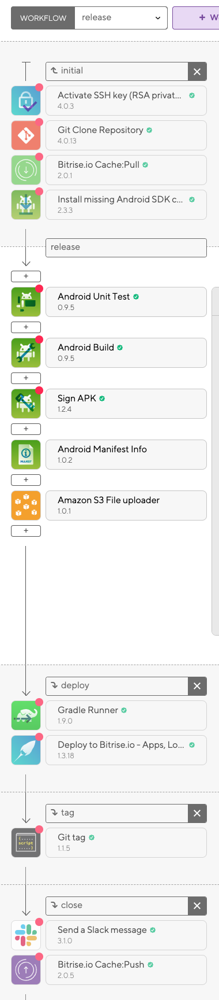

# Bitrise


## 📌 개요

[앞장](https://github.com/Knowre-Dev/AndroidDevCurriculum/blob/master/KnowreSpecific/CICD/CICD.md)에서 설명한것처럼 Bitrise는 CI/CD 환경을 쉽게 구축할 수 있도록 해주는 플랫폼(PaaS - Platform as a Service)이다. 모바일 앱 개발(iOS, Android, React Native, Flutter 등) 프로젝트에 특화되어있다(고 docs 에 설명되어있다).

Bitrise를 이용해 CI/CD 환경을 구축하는 방법을 요약하면 아래와같다.

1. Git repository 연결
2. Workflow Editor 로 Task 등록(트리거가 발동하면 어떤 Task 를 수행할지)
3. 코딩하러가기(Just push code🤩)

<br>

## 📌 Repository 와 Bitrise 연동하기

먼저 Android app project 를 연동하는 방법은 [가이드](https://devcenter.bitrise.io/getting-started/getting-started-with-android-apps/)에 잘 설명되어있으니 참고해서 따라하면 된다. 여기서 설명하는 순서를 정리하면 아래와 같다.

1. Bitrise Dashboard 에서 App 추가
   - 친숙한 Web UI로 만들자!😏
2. 연결할 Github Repository에 대한 접근 권한(SSH Keys) 설정
   - 자동으로 해준다. 🔮
3. default branch 선택(ex. master)
4. 프로젝트의 build configuration 설정
   - 이것도 자동으로 해준다.
5. Webhook 설정
   - 자동으로 등록할 수 있다. 나중에 Code 탭에서 설정 가능하다.
   - Webhook이란, **서버에서 어떠한 작업이 수행되었을 때 클라이언트에게 해당 작업이 수행되었음을 알려주는 것**이다. 
   - Github 저장소에서 Code push, PR 등의 이벤트가 발생했을 때 Bitrise에게 알려주기 위해 필요한 작업이다.
   - 이를 등록하지않으면 Bitrise 에서 트리거가 동작하지 않는다.
   - 참고 : [개념설명](https://docs.iamport.kr/tech/webhook), [Github docs](https://developer.github.com/webhooks/)

다음은 프로젝트에 Bitrise app을 연동했으니, 어떤 Task 를 자동화할지 설정해보자.

> 여기까지만 해도 해당 저장소에 코드를 푸시할 때 Bitrise 에서 기본적으로 세팅되어있는 workflow(Primary) 가 동작한다.

#### 😨 혹시 빌드 오류 lint 관련 Build fail 이 발생한다면!

- gradle(app)에 아래 코드를 넣어주자. [참고](http://google.github.io/android-gradle-dsl/current/com.android.build.gradle.internal.dsl.LintOptions.html)

```groovy
lintOptions { abortOnError false }
```

<br>

## 📌 Workflow 설정하기

Bitrise 에서는 [WorkFlow Editor](https://app.bitrise.io/features/workflow-editor)를 이용하여 어떤 작업들을 수행(자동화)할지 쉽게 설정할 수 있다. 편리한 GUI가 제공되어 스크립트를 따로 작성할 필요가 없기 때문에 타 CI/CD 플랫폼보다 쉽게 설정할 수 있는게 가장 큰 장점이다. (사실 다른 CI/CD 플랫폼을 사용해본 경험이 없어 더 편한게 있을지도 모른다🤪)

아무튼, 정의된 이벤트가 트리거 될 경우 설정해놓은 workflow를 따라 작업이 진행된다. 아래는 knowre에서 사용하는 Task들의 목록이다. 더 많은 작업은 [여기](https://www.bitrise.io/integrations/steps?platform=android)에서 확인할 수 있다.

> TMI: Task 는 오픈소스로 구현되어있어 해당 작업을 어떻게 수행하는지 Github repository에 가서 소스코드를 확인할 수 있다.

- Activate SSH Key(RSA private key)
- Android Unit Test
- Android Build
- Sign APK
- Android Manifest Info
- Amazon S3 File uploader
- Gradle Runner
- Git tag

그리고 workflow의 task 에서 필요한 값(환경변수)들은 아래와 같은 탭에서 정의할 수 있다.

#### Code signing

- Android keystore file :  apk signing 을 위해 필요한 값들을 세팅할 수 있다.
- Generic file storage : Task 에서 필요한 파일을 업로드하여 다운로드 url 로 제공한다.
  - 여기에 업로드한 파일 경로를 가져오기 위해서는 **File Downloader** task 를 추가하여 `$BITRISE_SOURCE_DIR/파일명`에 저장해야한다. (매우 번거로움😒)
  - Firebase distribution을 gradle로 배포하는 과정을 설정하던중에 이걸 못찾아서 오랜 시간이 걸렸다(그러나 아직 해결은 못함...😭)

#### 그 외

- Secrets : 외부에 노출되면 안되는 환경변수들을 관리할 수 있다.
- Env Vars : 환경변수들을 관리할 수 있다.
- Triggers : 특정 브랜치에 이벤트(Push, PR)가 발생하면 수행할 workflow 를 설정할 수 있다.

그리고 하나의 workflow에는 여러 Task 가 포함될 수 있고, workflow 집합을 모아 workflow를 정의할 수 있다. Knowre는 release 버전을 위한 workflow 를 아래와같이 관리한다.



Workflow 를 initial, deploy, tag, close 로 나눠서 관리하는 이유는 debug, QA 의 경우에도 같은 작업들을 수행하기 때문이다. 이 부분에서 중요한점은 workflow는 Call by reference 이라는 것이다!(...😱) 어떤 곳에서 사용되는 workflow의 task 를 수정하거나 삭제하면 해당 workflow 를 사용하는 모든 workflow 에 영향을 받기때문에 주의해야한다.

> 실제 사례를 상기해보면 이 부분을 잘못건드려서 release 에 Tag push task가 사라져있던 경우가 있었다. (아마도..?)

<br>