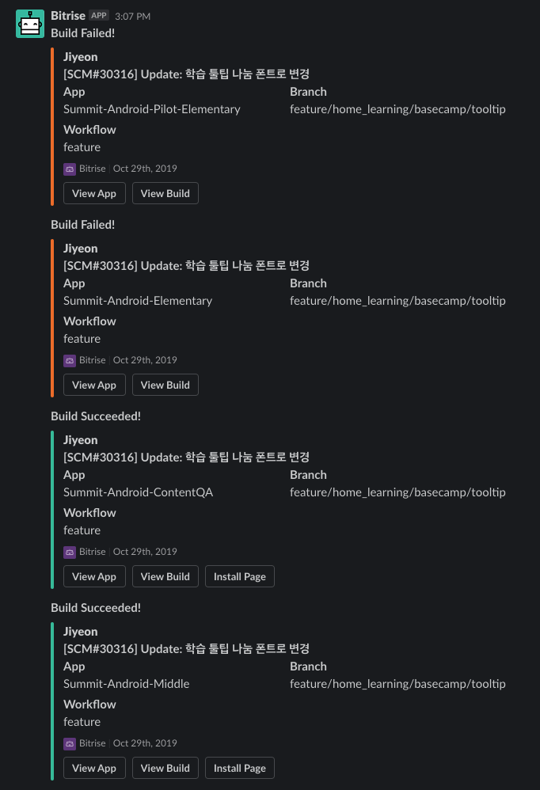

# Continuous Integration and Continuous Delivery (CI/CD)

## 📌 CI/CD 란 무엇인가?

###CI (Continuous Integration) 

CI는 **모든 개발이 끝난 이후 코드를 관리하는 고전적 방식의 단점**을 해결하기 위해 나타난 개념이다. 개발 진행중에 다른 개발자들의 코드를 통합하는 작업을 자동화시켜 코드 품질을 유지할 수 있다. 또한 테스트 코드가 구현되어 있을 경우 정의된 테스트 케이스를 지속적으로 수행할 수 있다.

- 빌드가 성공적으로 끝났으니 Git 에 푸시하고 PR 요청, merge 만 잘 되면 장땡 아닐까? 그리고 애초에 코드에 conflict 가 발생하면 Github 에서 알려주니까 이것만 조심하면 되지 않을까?
  - Github 만 믿어서는 안된다. 내 컴퓨터에서는 빌드가 잘 됐어도 다른 개발자들의 코드가 합쳐졌을때는 상황이 달라질 수 있다.
- 또한 Build type 이 여러개로 정의되어있거나 flavor, dimension 별로 활성화되는 소스 디렉터리가 다를 경우도 고려해야한다.
  - 하나의 프로젝트에서 여러개의 앱을 빌드하는 경우에는 더 유의해야한다.
  - 피쳐를 개발할 때마다 모든 build type(flavor, dimension)에 대해 빌드를 돌려보는 것은 엄청난 시간 낭비가 될 것이므로 자동화시켜놓으면 작업 시간을 단축시킬 수 있을 것이다.
    - 아래 첨부한 스크린샷과 같이 일부 타입에서만 빌드 실패가 발생할 수 있다. (주황색은 실패, 초록색은 성공한 것이다. 로컬에서는 빌드가 잘 돼서 푸시했더니 오류가 발생했다!)
- 테스트(Unit, UI)코드가 정의되어있는 경우 코드 통합이 끝나면 정의된 모든 테스트케이스를 실행한다.
  - 만약 테스트 케이스를 통과하지 못하면 빌드가 실패한다.
  - 이 과정에서 개발자의 실수를 발견할 수 있다.
    - 개발중에는 크리티컬한 이슈가 아닐 경우 실수를 인지하기 어렵다. (테스트 코드 작성의 중요성!)

 

###CD (Continuous Delivery/Deployment)

CD는 지속적으로 배포로, 소프트웨어가 항상 신뢰 가능한 수준에서 배포될 수 있도록 지속적으로 관리하자는 개념이다. 쉽게 말해 CI의 연장선(하지만 필수 작업)으로, 통합과 테스트가 성공적으로 이루어졌을 때 빌드 결과물(앱)을 자동으로 배포하는 것이다. 모바일 앱 기준으로 배포하는 곳은 QA 테스트를 진행할 수 있는 [Fabric Beta(deprecate)](https://github.com/Knowre-Dev/AndroidDevCurriculum/blob/master/KnowreSpecific/CICD/Bitrise/Beta/Beta.md)나 [Firebase app distribution](https://github.com/Knowre-Dev/AndroidDevCurriculum/blob/master/KnowreSpecific/CICD/Bitrise/AppDistributions/AppDistributions.md) 이 있고, 빌드된 APK 파일을 업로드할 [AWS S3](https://github.com/Knowre-Dev/AndroidDevCurriculum/blob/master/KnowreSpecific/CICD/Bitrise/Aws/Aws.md) 가 있다.

- 그래서 개발자는 코드만 푸시해서 CI 에서의 빌드를 성공시키면 되고, 빌드가 끝나면 배포된 앱을 다운로드하여 QA 를 진행하면 된다.
  - Fabric beta나 FB App distribution을 이용하면 QA 앱을 더 쉽게 다운로드받을 수 있다.
  - 버전까지 잘 관리해주면 더할나위가 없다. (이전 버전과 최신버전을 비교하고싶을 때 버튼 클릭 하나만으로 전환 가능)

이렇게 CI, CD 를 구현함으로써 개발자는 코드만 푸시했을 뿐인데 여러 type 에 대한 빌드, 유닛 테스트, QA 앱 전달 및 릴리즈 앱 업로드까지 지속적으로(완전 자동으로) 작업할 수 있게 되는 것이다.

 

## 📌 Next Step

CI/CD 환경을 구축할 수 있는 솔루션은 CircleCI, Travis, Jenkins 와 같이 여러개가 있다. 하지만 여기서는 더 쉽게 구축할 수 있는 솔루션(플랫폼?)인 [Bitrise](https://github.com/Knowre-Dev/AndroidDevCurriculum/blob/master/KnowreSpecific/CICD/Bitrise/Bitrise.md) 에 대해 알아볼 것이다.

 

### References

- [[QA] 빌드 자동화, 배포 자동화, 테스트 자동화](https://itholic.github.io/qa-build-automation/)
- [[QA] CI/CD 란?](https://itholic.github.io/qa-cicd/)